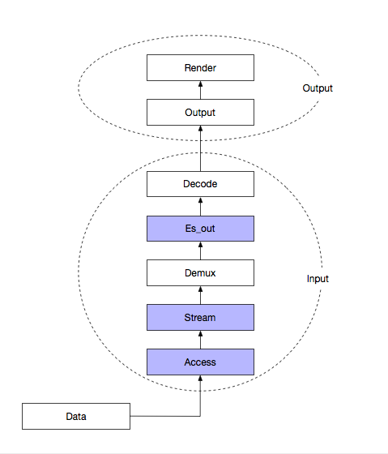
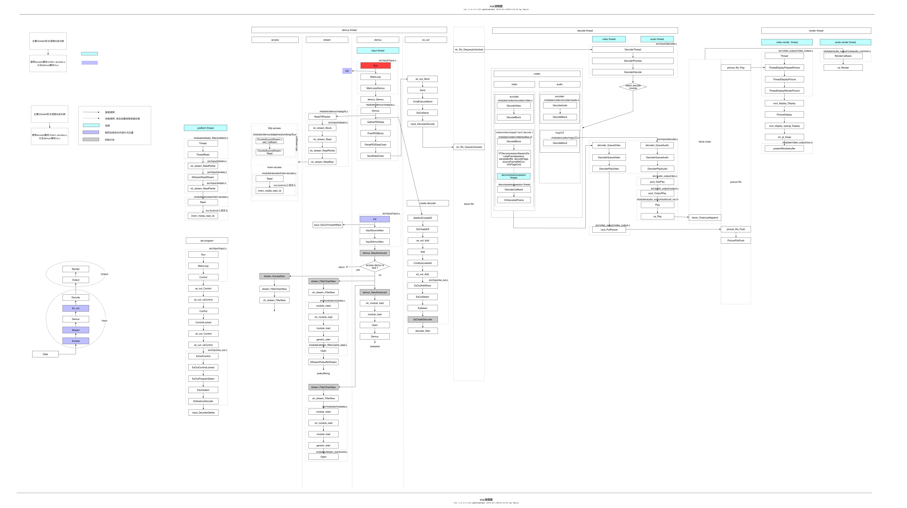

## VLC源码分析
Decin Jan 12th, 2018 VLC


### 0x00 前置信息
VLC是一个非常庞大的工程，我从它的架构及流程入手进行分析，涉及到一些很细的概念先搁置一边，日后详细分析。

### 0x01 源码结构
```
.
├── AUTHORS
├── COPYING
├── COPYING.LIB
├── INSTALL
├── NEWS
├── README
├── THANKS
├── aclocal.m4
├── autom4te.cache
│   ├── output.0
│   ├── output.1
│   ├── output.2
│   ├── output.3
│   ├── requests
│   ├── traces.0
│   ├── traces.1
│   ├── traces.2
│   └── traces.3
├── autotools
│   ├── compile
│   ├── config.guess
│   ├── config.rpath
│   ├── config.sub
│   ├── depcomp
│   ├── install-sh
│   ├── ltmain.sh
│   ├── missing
│   ├── test-driver
│   └── ylwrap
├── bin
│   ├── breakpad.cpp
│   ├── cachegen.c
│   ├── darwinvlc.m
│   ├── override.c
│   ├── rootwrap.c
│   ├── vlc.c
│   ├── vlc_win32_rc.rc.in
│   └── winvlc.c
├── bootstrap
├── build-iPhoneOS
│   ├── arm64
│   ├── armv7
│   └── armv7s
├── build-iPhoneSimulator
│   ├── i386
│   └── x86_64
├── compat                          存放可能使用的函数
├── contrib
│   ├── bootstrap                   第三库的编译脚本, bootstrap?
│   ├── iPhone-aarch64-apple-darwin14-aarch64
│   ├── iPhone-armv7-apple-darwin14-armv7
│   ├── iPhone-armv7s-apple-darwin14-armv7s
│   ├── iPhone-i386-apple-darwin14-i386
│   ├── iPhone-x86_64-apple-darwin14-x86_64
│   ├── iPhoneOS-aarch64
│   ├── iPhoneOS-armv7
│   ├── iPhoneOS-armv7s
│   ├── iPhoneSimulator-i386
│   ├── iPhoneSimulator-x86_64
│   ├── src                         第三方库源码包的校验和, 和补丁(可以在此处对第三库进行打补丁)
│   └── tarballs                    第三方库源码包(tar.bz2)
├── doc
├── extras
│   ├── analyser
│   ├── breakpad
│   ├── buildsystem
│   ├── misc
│   ├── package
│   └── tools
├── include
│   ├── vlc
│   ├── vlc_access.h
│   ├── vlc_actions.h
│   ├── ...
├── install-iPhone
│   ├── contrib
│   ├── core
│   └── plugins
├── install-iPhoneOS
│   ├── arm64
│   ├── armv7
│   └── armv7s
├── install-iPhoneSimulator
│   ├── i386
│   └── x86_64
├── lib                             libvlc接口层, 对src/封装播放器接口
│   ├── audio.c
│   ├── core.c
│   ├── dialog.c
│   ├── error.c
│   ├── event.c                     事件管理, play, stop, pause, bufferring等事件
│   ├── libvlc.sym                  ib的接口列表, 具体作用?
│   ├── libvlc_internal.h
│   ├── log.c
│   ├── media.c                     构建输入源, 一个源代表一个media(http://..., file://..)
│   ├── media_discoverer.c
│   ├── media_internal.h
│   ├── media_library.c
│   ├── media_list.c                构建多个输入源
│   ├── media_list_internal.h
│   ├── media_list_path.h
│   ├── media_list_player.c
│   ├── media_player.c              播放器play, stop, pause, seek等接口
│   ├── media_player_internal.h
│   ├── playlist.c
│   ├── renderer_discoverer.c
│   ├── renderer_discoverer_internal.h
│   ├── video.c                     record, snapshot等接口
│   └── vlm.c
├── m4                              autoMake和autoconf的宏文件
│   ├── ax_append_compile_flags.m4
│   ├── ax_append_flag.m4
│   ├── ...
├── make-alias
├── modules
│   ├── access                      access模块
│   ├── access_output
│   ├── arm_neon
│   ├── audio_filter
│   ├── audio_mixer
│   ├── audio_output                频输出模块, 连接硬件, 如audiounit_ios.m, opensles_android.c
│   ├── codec                       编解码器模块
│   ├── control
│   ├── demux                       解复用模块, 解析音视频流等
│   ├── gui                         各平台的UI
│   ├── hw
│   ├── keystore
│   ├── list.sh
│   ├── logger
│   ├── lua
│   ├── meta_engine
│   ├── misc                        被libvlc其他部分使用杂项, 如线程系统, 消息队列, CPU探测, 对象查询系统
│   ├── mux                         复用模块, 流的打包
│   ├── notify
│   ├── packetizer
│   ├── services_discovery
│   ├── spu                         字画面(subtitle, epg osd).
│   ├── stream_extractor
│   ├── stream_filter
│   ├── stream_out
│   ├── text_renderer
│   ├── video_chroma
│   ├── video_filter
│   ├── video_output                视频输出模块, 连接硬件, 如ios.m, android/目录下
│   ├── video_splitter
│   └── visualization
├── share                           图标、脚本
├── src                             vlc架构核心代码
│   ├── check_headers/
│   ├── check_symbols/
│   ├── config/                     从命令行和配置文件加载配置，提供功能模块的读取和写入配置.
│   ├── extras/                     平台特殊性相关代码。
│   ├── interface/                  提供代码中可以调用的接口中，如按键后硬件作出反应。
│   ├── libvlc-module.c             热键, 设置界面显示文字等
│   ├── libvlc.c
│   ├── libvlc.h
│   ├── libvlccore.sym
│   ├── misc/                       各种混合, 包含picture_fifo.c, fifo.c, variables.c, libvlc使用的其他部分功能，如线程系统，消息队列，CPU的检测，对象查找系统，或平台的特定代码。
│   ├── modules/                    模块管理, 模块选择, 模块加载。
│   ├── network/                    提供网络接口, tcp, udp等。
│   ├── playlist/                   管理播放功能，如停止，播放，下一首，随机播放等。
│   ├── revision.c
│   ├── revision.txt
│   ├── version.c
│   ├── test/                       src的测试代码。
│   ├── text/                       字符集。
│   ├── input/                      显示(output)前的大部分流程, access, demux, es_out, decoder.
│   ├── stream_output/              输出音频流和视频流到网络。
│   ├── audio_output/               从解码后的数据队列中获得的数据后播放.
│   ├── video_output/               从解码后的数据队列中获得的数据后播放, 子画面生成(subtitle, epg osd)等。
│   ├── darwin/                     苹果系统相关, 文件系统相关, posix thread的vlc封装等.
│   ├── os2/                        os2平台相关, 同上.
│   ├── posix/                      posix规范, 同上.
│   ├── linux/                      linux系统相关, 同上.
│   ├── android/                    android系统相关, 同上.
│   └── win32/                      类似同上.
└── test                            测试代码.

```

### 0x02 基础概念

* 对于一个视频的播放，播放器的执行步骤大致如下：
	1. 读取原始数据
	2. 解复用(demux)
	3. 解码(decode)
	4. 显示(render)


* VLC在包含以上概念的基础上，又抽象出几个其他概念，先列出VLC中抽象出来的重要概念：
	* playlist: playlist表示播放列表，VLC在启动后，即创建一个playlist thread，用户输入后，动态创建input。
	* input: input表示输入，当用户通过界面输入一个文件或者流地址时，input thread 被动态创建，该线程的生命周期直到本次播放结束。
	* access: access表示访问，是VLC抽象的一个层，该层向下直接使用文件或网络IO接口(http, rstp等)，向上为stream层服务，提供IO接口。
	* stream: stream表示流，是VLC抽象的一个层，该层向下直接使用access层提供的IO接口，向上为demux层服务，提供IO接口。
	* demux: demux表示解复用，是视频技术中的概念，该层向下直接使用stream层提供的IO接口，数据出来后送es_out。
	* es_out: es_out表示输出，是VLC抽象的一个层，该层获取demux后的数据，送decode解码。
	* decode: decode表示解码，是视频技术中的概念，获取es_out出来的数据(通过一个fifo交互)，解码后送output。
	* output: output表示输出，获取从decode出来的数据，送readerer。
	* render: render表示显示，获取从output出来的数据(通过一个fifo交互)，然后显示。

下图显示了这些抽象的概念的关系，其中蓝色表示VLC抽象的概念。



### 0x04 架构综述
VLC的整体框架是设计成一套module的管理机制，将功能分类并抽象成modules。

VLC main： player的main。初始化libVLC 并加载用户界面。
libVLCcore：libvlc的核心，抽象出了一个libvlc_instance_t 对象，提供modules的装载/卸载机制。
modules： modules提供具体的功能，比如上面的access，demux，decode就是以一个模块的形式存在。
External libraries：外部开源库。

#### 模块管理
模块位于 modules/子目录，在运行时被加载。每一个模块提供不同的特征适应特定的文件的环境。另外，大量的不断编写的可移植功能位于audio_output/，vidco_output/ 和 gui/模块，以支持新的平台(如:BeoS Mae OS X)。

模块中的插件被位于 src/misc/modules.c 和 include/modules\*.h 中的函数动态加载和卸载。写模块的 API 描述如下，共 3 种:

- (1)模块描述宏:声明模块具有哪种优先级的能力(接口，demux2 等等)，还有GUI模块的实现参数，特定模块的配置变量，快捷方式，子模块等等;
- (2)Open(vlc_object_t* p_object):被 VLC 调用初始化这个模块，它被模块描述宏赋值给了 结构体 module_t 中的 pf_activate 函数指针，被 module_need 调用;
- (3)Close(vlc_object_t* p_object):被 VLC 调用负初始化这个模块，保证消耗 Open 分配的所 有资源。它被模块描述宏赋值给了结构体 module_t 中的 pf_deactivate 函数指针，被 module_unneed 调用。

用 libvlc 写的模块能够直接被编译进 vlc，因为有的 OS 不支持动态加载代码。被静态编译进 vlc 的模块叫做内置模块。

模块的加载方式：
首先模块先将自身注册到VLC中，代码片段如：
```
 vlc_module_begin()
 ...
 vlc_module_end()
```

然后在需要加载模块的时候，调用module_need接口，去找到合适的模块。找到合适的模块后，会执行注册中设置的回调方法，诸如Open*名字的方法。
同样自己可以实现模块，只需要按照VLC模块的标准即可。VLC中很多模块就是通过外部的开源库实现的。

vlc中模块大致分类：


#### 线程管理
VLC 是一个密集的多线程应用。由于解码器必须预先清空和播放工序必须预先做好流程
(比如说解码器和输出必须被分开使用，否则无法保证在要求的时间里播放文件)，因此 VLC 不采用单线程方法。目前不支持单线程的客户端，多线程的解码器通常就意味着更多的开销 (各线程共享内存的问题等)，进程间的通信也会比较复杂。

VLC 的线程结构基于 pthreads 线程模型。为了可移植的目的，没有直接使用 pthreads 函数，而是做了一系列类似的包裹函数:vlc_thread_create，vlc_thread_exit，vlc_thread_join， vlc_mutex_init ， vlc_mutex_lock ， vlc_mutex_unlock ， vlc_mutex_destroy ， vlc_cond_init ， vlc_cond_signal ， vlc_cond_broadcast ， vlc_cond_wait ， vlc_cond_destroy 和 类 似 结 构:vlc_thread_t，vlc_mutex_t，and vlc_cond_t。

线程同步

VLC 的另一个关键特征就是解码和播放是异步的:解码由一个解码器线程工作，播放由音
频输出线程或者视频输出线程工作。这个设计的主要目的是不会阻塞任何解码器线程，能够 及时播放正确的音频帧或者视频帧。这样实现也导致产生了在接口，输入，解码器和输出之 间的一个复杂的通讯结构。

虽然当前接口并不允许，但是让若干个输入和视频输出线程在同一时刻读取多个文件是 可行的(这是 VLC 未来改进的主要方向)。现在的客户端就是用这种思想实现的，这就意味着 如果没有用到全局锁的话那么一个不能重入的库是不能被使用的(尤其是 liba52 库)。

VLC 输出的流里包含时间戳，被传递给解码器，所有有时间戳标记的流也均被记录，这
样输出层可以正确及时的播放这些流。时间 mtime_t 是一个有符号的 64-bit 整形变量，单位 是百万分之一秒，是从 1970 年 7 月 1 日以来的绝对时间。

当前时间能够被 mdate()函数恢复。一个线程可以被阻塞到 mwait(mtime_t date)等到一 个确定的时间才被执行。也可以用 msleep(mtime_t delay)休眠一段时间。如果有重要的事情 要处理的话，那么应该在正常时间到来之前被唤醒(如色度变换)。例如在 modules\codec\synchro.c 中，通常的解码时间被记录，保证图像被即时解码。

### 0x05 流程分析
程序通过用户配置的方式来加载不同的模块，以下主要对ts流播放流程进行跟踪：
首先，给出流程图，参照该图，再继续下面的流程分析，绿色线表示打开VLC后的执行操作；黑色线表示用户输入一个视频后的执行操作；蓝色线从红色圈开始，表示开始播放输入流后的数据流向。


(1) main函数（vlc/bin/vlc.c）

+ 1.参数信号处理相关，不详分析。
+ 2.调用libvlc_new()初始化一个libvlc_instance_t实例。(libvlc_instance_t is opaque. It represents a libvlc instance)
	- 2.1 调用libvlc_InternalCreate创建一个libvlc_int_t。(This structure is a LibVLC instance, for use by libvlc core and plugins.)
	- 2.2 调用libvlc_InternalInit初始化libvlc_int_t实例。
	- 2.3 初始化libvlc_instance_t其他成员。
+ 3.调用libvlc_add_intf添加模块。
	- 3.1 获取playlist，如果为空，则调用playlist_Create创建一个playlist结构，并调用playlist_Activate创建新的playlist线程Thread(src/playlist/thread.c)。
	- 3.2 调用intf_Create创建一个默认的interface。
	- 3.2.1 调用vlc_custom_create创建一个vlc object(intf_thread_t)。
	- 3.2.2 注册一个添加interface的回调方法。
	- 3.2.3 调用module_need加载一个interface模块。

调用libvlc_playlist_play，如果播放列表不为空，并且被设置为自动播放，则播放播放列表内容。
信号处理相关，不详分析。

(2) 创建一个输入

+ 1 通过libvlc_media_list_player控制播放, libvlc_media_list_player_play_item
	+ 1.1 初始化成功后，程序运行在playlist的线程Thread(src/playlist/thread.c)中，循环接收界面输入的请求。
	+ 1.2 当输入一个新的文件或者流地址，在PlaylistVAControl获得信号，并发送该信号。
	+ 1.3 Thread接收到播放请求后，在LoopRequest中调用PlayItem方法。
		- 1.3.1 调用input_Create创建一个input(input_thread_t *p_input_thread, 注意这里并不是线程指针而是自定义结构体, input线程的相关信息)结构，并初始化各种成员，其中包括调用input_EsOutNew创建p_es_out_display(es_out)。
		- 1.3.2 调用input_Start创建一个input线程, 入口函数为Run(src/input/input.c)。
+ 2 通过libvlc_media_player控制播放, 调用libvlc_media_player_play
	- 2.1 input_Create创建(同1.3.1)
	- 2.2 同1.3.2

(3) 初始化输入

+ 1.调用Run(src/input/input.c)中的Init方法，开始初始化。
+ 2.调用input_EsOutTimeshiftNew新建一个50M的Timeshift(暂停缓存)，包括创建并初始化p_es_out(es_out)，与后续步骤9相关。
设置input的状态为OPENING_S。
+ 3.调用InputSourceNew, 调用input_SplitMRL分解输入uri, 调用InputDemuxNew创建输入Demux模块
	- 3.1 以stream形参为NULL调用demux_NewAdvanced加载"access_demux"模块(first, try to create an access demux)。如:rtsp://源则有access_demux模块, 而不需要走以下步骤分步创建.
	- 3.2 如果没有合适的"access_demux"模块，则调用stream_AccessNew创建一个实际的access模块(stream_t* p_stream)。(not an access-demux: create the underlying access stream)
		- 3.2.1 调用vlc_stream_CommonNew创建stream_t结构体(作为access)。
		- 3.2.2 调用module_need加载合适的access模块。
		- 3.2.3 调用access模块的Open*方法，以avio模块为例。
			- 3.2.3.1 调用vlc_init_avformat初始化VLC即avformat环境。
			- 3.2.3.2 调用avio_open2打开该uri。
			- 3.2.3.3 设置access的IO方法指针。
	- 3.3 通过stream_FilterChainNew添加明确的stream_filter.(attach explicit stream filters to stream)
	- 3.4 以stream形参为p_stream调用demux_NewAdvanced创建常规的demux模块.(create a regular demux with the access stream created)
		- 3.4.1 调用vlc_custom_create创建demux_priv_t结构体, 并初始化(demux_priv_t *)priv->demux。
		- 3.4.2 调用vlc_module_load加载合适的demux模块。
		- 3.4.3 调用demux模块的Open*方法，以avformat/demux模块为例。
			- 3.4.3.1 调用stream_Peek从stream层获取数据，用于分析输入的文件格式。
			- 3.4.3.2 调用av_probe_input_format分析输入的文件格式。
			- 3.4.3.3 设置demux_sys_t结构体部分变量的值。
			- 3.4.3.4 调用avformat_alloc_context分配AVFormatContext结构体。
			- 3.4.3.5 调用avio_alloc_context设置AVFormatContext结构体的AVIOContext类型成员pb，并设置read和seek方法指针。
			- 3.4.3.6 调用avformat_open_input打开一个输入，这里的input与VLC中的input不是一个概念，关于avformat_open_input的分析详见我的另一篇文章《avformat_open_input详细分析》链接地址。
			- 3.4.3.7 调用avformat_find_stream_info分析流信息，该方法通过读取数据初始化流以及流解码信息。
			- 3.4.3.8 根据分析的流信息，设置fmt变量，并调用es_out_Add。
			- 3.4.3.9 实际调用EsOutAdd(src/input/es_out.c)，添加一个es_out，有几个流就做几次es_out_Add操作，比如该输入中有一个视频流和一个音频流，则作两次es_out_Add操作。
			- 3.4.3.10 nb_chapters相关未详细分析。
	
	- 3.5 设置record相关。
	- 3.6 调用demux_Control设置demux pts delay。
	- 3.7 调用demux_Control设置fps。
	
+ 4.调用demux_Control获取输入的长度。
+ 5.调用StartTitle显示标题。
+ 6.调用LoadSubtitles加载字幕。
+ 7.调用LoadSlaves，含义不详。
+ 8.调用InitPrograms，设置es_out和decoder相关。
	- 8.1 调用UpdatePtsDelay计算正确的pts_delay值。
	- 8.2 sout相关可选，暂不分析。
	- 8.3 调用es_out_SetMode，设置es_out的mode为ES_OUT_MODE_AUTO。
	- 8.4 以DEMUX_SET_GROUP指令调用demux_Control，DEMUX_SET_GROUP/SET_ES only a hint for demuxer (mainly DVB) to allow not reading everything。
+ 9.实际调用EsOutControlLocked进入case ES_OUT_SET_MODE分支。
	- 9.1 设置es_out_sys_t 的b_active和i_mode。
	- 9.2 调用EsOutSelect方法，根据指定模块选择一个es_out。
	- 9.3 在EsOutSelect方法中进入ES_OUT_MODE_AUTO分支，进一步调用EsSelect方法，再进一步调用EsCreateDecoder方法创建decoder。
		- 9.3.1 调用input_DecoderNew创建一个新的decoder。
		- 9.3.2 如果需要缓存，调用input_DecoderStartWait发送信号，开始线程等待。
		- 9.3.3 调用EsOutDecoderChangeDelay设置decode delay。
+ 10.续9.3.1进入decoder_New方法。
	- 10.1 调用CreateDecoder创建decoder配置结构体。
	- 10.1.1 调用vlc_custom_create创建一个vlc object(decoder_t)。
	- 10.1.2 新建decode fifo。
	- 10.1.3 调用module_need加载适配的解码模块。
		- 10.1.3.1  调用decode模块的OpenDecoder方法，以codec/avcodec模块为例。
		- 10.1.3.2 调用GetFfmpegCodec方法 determine codec type（源码描述）。
		- 10.1.3.3 调用vlc_init_avcodec方法初始化解码环境。
		- 10.1.3.4 调用avcodec_find_decoder设置AVCodec。
		- 10.1.3.5 调用avcodec_alloc_context3分配一个AVCodecContext。
		- 10.1.3.6 调用Init*Dec系列初始化解码环境。
		- 10.1.4 初始化decoder_t结构体其他成员。
	- 10.2 调用vlc_clone创建解码线程DecoderThread。

+ 12.续10.1.3.5，以InitVideoDec为例。
	- 12.1 为decoder_sys_t结构分配内存。
	- 12.2 设置相关回调方法。
	- 12.3 设置解码线程类型。
	- 12.4 调用ffmpeg_InitCodec初始化extradata相关数据。
	- 12.5 调用OpenVideoCodec方法，设置解码的长宽及采用率，进一步调用avcodec_open2打开codec。
	- 根据需要，设置线程优先级。
	- 设置meta相关。
	- 初始化完成，设置该input的状态为PLAYING_S。

(4) 播放输入
MainLoop(src/input/input.c)

+ 1.调用MainLoopDemux访问demuxer去demux数据。
+ 2.进一步调用在加载demux模块时设置的demux方法，同样以avformat/demux模块为例，实际调用Demux方法(module/demux/avformat/demux.c)。
	- 2.1 调用av_read_frame读取一帧数据。
	- 2.2 判断读取无误时，则为block_t结构分配内存，并将这一帧从AVPacket中拷贝至block_t结构中。
	- 2.3 如果该帧是I帧，则设置I帧标致位。
	- 2.4 时间戳处理相关，未深入分析。
	- 2.5 根据需要调用es_out_Control设置PCR，未深入分析。
	- 2.6 调用es_out_Send将这一帧数据发送给es_out。
	- 2.7 调用av_free_packet释放这一帧数据。

+ 3.调用es_out_Send后，实际调用EsOutSend(src/input/es_out.c)方法。
	- 3.1 调用stats_Update更新相关状态，具体未详分析。
	- 3.2 设置预读相关，如果需要预读，并且到的数据的pts小于预读需要的时间，则设置BLOCK_FLAG_PREROLL标志位。
	- 3.3 检查sout mode，具体有sync 和async mode，异同未详细分析。
	- 3.4 如果设置record，将数据dup后送decoder。
	- 3.5 调用input_DecoderDecode将block_t的数据送至decode fifo中。
		- 3.5.1 判断控制速度线程等待相关信息，具体未详细分析。
		- 3.5.2 如果decode fifo超过最大长度，则清空重置decode fifo。
		- 3.5.3 调用block_FifoPut将该block_t的数据压入decode fifo，并通知读取线程。
	- 3.6 格式变化判断处理相关，未详细分析。
	- 3.7 字幕处理相关，未详细分析。

+ 4.续3.5进入decode read thread，即DecoderThread(src/input/decoder.c)。
	- 4.1 调用block_FifoGet方法，从decode fifo中获取数据。
	- 4.2 基于某些条件，发送停止等待消息给其他线程，未详细分析。
	- 4.3 调用DecoderProcess方法开始decode a block。
	- 4.4 判断输入流的格式，调用不同的方法，这里以视频流为例，调用DecoderProcessVideo方法。
	- 4.5 packetizer相关为深入分析，在DecoderProcessVideo方法中进一步调用DecoderDecodeVideo方法。

+ 5.续4.5调用pf_decode_video，这里以avcodec模块的decoder为例，即DecodeVideo(modules/codec/avcodec/video.c)方法，在该方法中，开始真正的解码。
	- 5.1 如果在Demux中获取的流信息中包含新的extradata，并且原来的extradata数据为空，则调用ffmpeg_InitCodec初始化codec，如果b_delayed_open为true，则调用OpenVideoCodec重新打开codec。
	- 5.2 调用av_init_packet初始化解码数据包。
	- 5.3 调用avcodec_decode_video2解码数据。
	- 5.4 调用av_free_packet释放内存。
	- 5.5 计算pts值，返回解码后的数据。
	- 5.6 如果opaque为空，则调用ffmpeg_NewPictBuf方法创建一个新的picture buffer。具体调用回调指针pf_vout_buffer_new指向的vout_new_buffer，进一步调用input_resource_RequestVout最终调用VoutCreate。
		- 5.6.1 调用vlc_custom_create创建一个vlc object(vout_thread_t)。
		- 5.6.2 调用spu_Create初始化sub picture unit。
		- 5.6.3 调用vlc_clone创建一个output线程Thread(src/video_output/video_output.c)。
		- 5.6.4 output线程循环调用vout_control_Pop，首次进入ThreadControl方法中，执行ThreadStart方向，创建picture fifo(p->decoder_fifo)。
+ 6.pf_decode_video返回后，解码后的数据保存在p_pic中，进一步调用DecoderPlayVideo方法，在该方法中调用vout_PutPicture将解码后的数据压入picture fifo中。
+ 7.当picture fifo中有数据后，vout线程调用ThreadDisplayPicture中的ThreadDisplayPreparePicture方法。
	- 7.1 调用picture_fifo_Pop从picture fifo中获取解码后的数据。
	- 7.2 如果延迟太大，并且设置延迟丢帧，则丢掉该帧数据。
+ 8.调用ThreadDisplayRenderPicture显示图像。

### 0x06 总结
对VLC的流程分析，主要通过跟踪数据流向的方式展开。对于最后显示部分的分析还不足，另外很多细节尚未深入。
附一张图:


参考：

+ [http://blog.csdn.net/tx3344/article/details/8517062](http://blog.csdn.net/tx3344/article/details/8517062)
+ [http://my.oschina.net/xiaot99/blog/197555](http://my.oschina.net/xiaot99/blog/197555)
